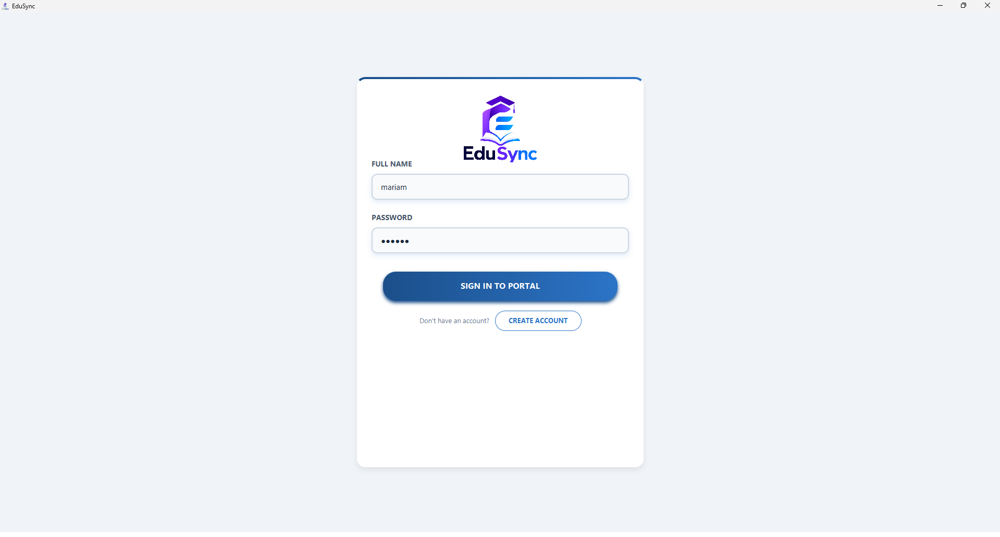
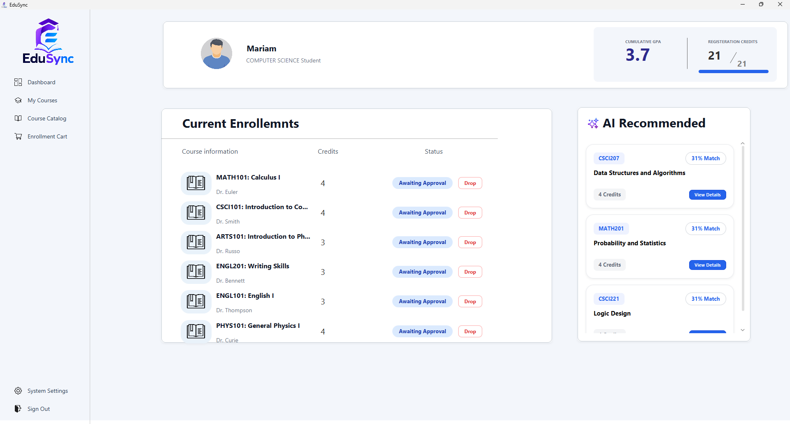
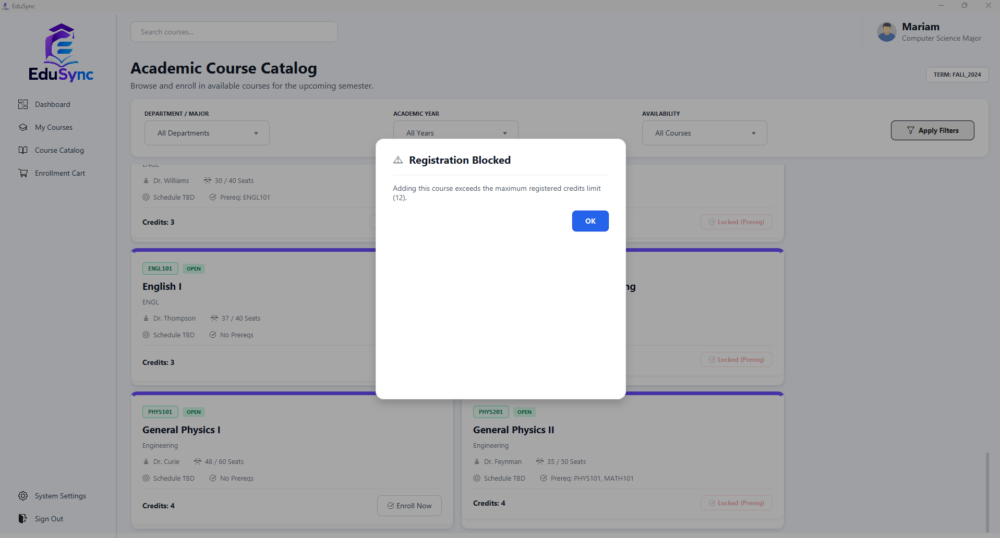
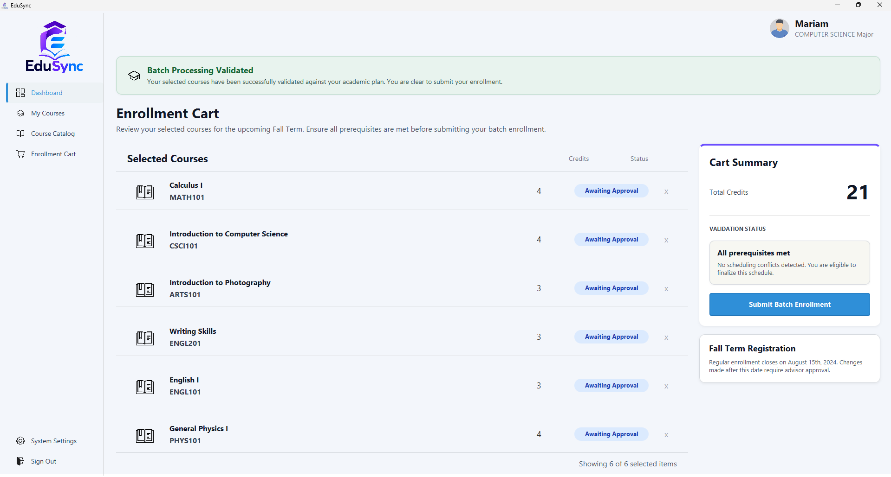
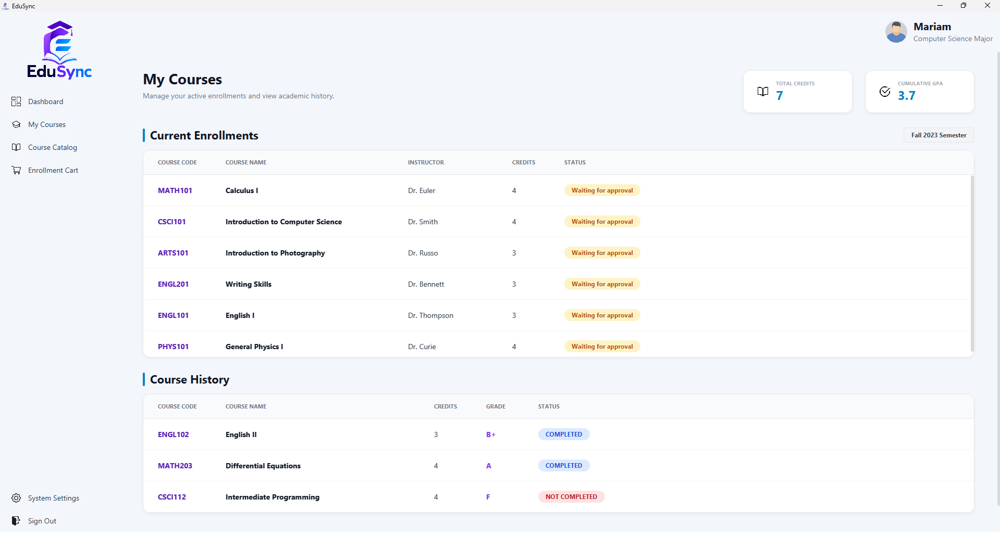
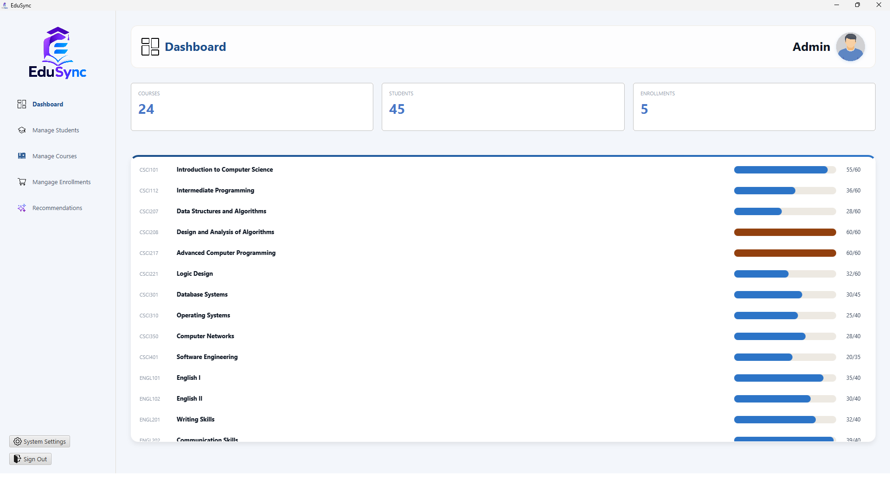
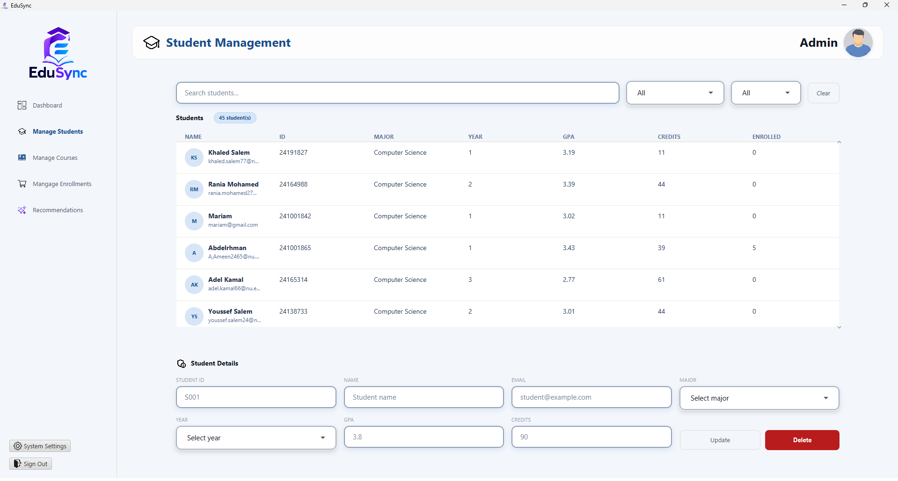
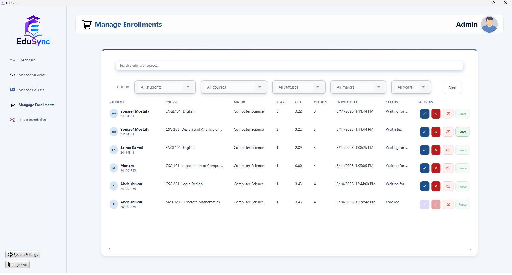
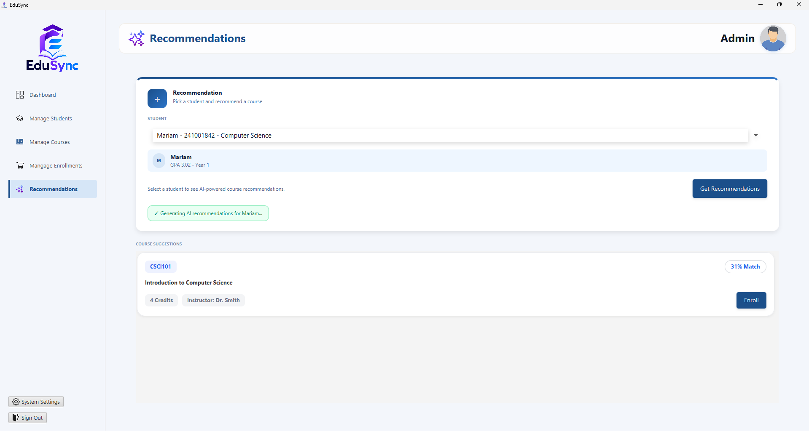

# Course Enrollment System

A JavaFX desktop application for managing academic course enrollment workflows for students and administrators. The system combines an FXML-based user interface, service-layer business rules, JSON-backed persistence, and a custom KNN-style recommendation engine built from enrollment history.

## Project Overview

The Course Enrollment System supports the core operations of an academic registration platform:

- Students can sign up, log in, browse available courses, manage enrollment activity, and access course recommendations.
- Administrators can monitor system activity, manage student records, manage courses, review enrollments, approve or reject enrollment requests, and force waitlisted students into seats when needed.
- Application data is stored in JSON files under the `data/` directory and loaded into memory through a custom `DataStore`.

The application is built around a layered MVC-style design:

```text
JavaFX FXML Views
-> Controllers
-> Services
-> DataStore
-> FileHandler
-> JSON Files
```

## Technology Stack

- **Language:** Java
- **UI Framework:** JavaFX with FXML
- **Build Tool:** Maven
- **Runtime Target:** Java 17+
- **Persistence:** JSON files
- **Serialization:** Jackson Databind with Java Time support
- **UI Libraries:** ControlsFX, FormsFX, ValidatorFX, Ikonli, BootstrapFX
- **Recommendation Logic:** Custom in-memory KNN-style collaborative filtering components

## Core Features

### Student Features

- Student signup and login.
- Student session handling.
- Course browsing and catalog display.
- Enrollment cart support.
- Course enrollment request creation.
- Waitlist assignment when courses are full.
- AI-style course recommendations based on similar student enrollment behavior.

### Admin Features

- Admin login.
- Admin dashboard with high-level system metrics.
- Student management with search, filters, update, and delete support.
- Course management with search, filters, capacity display, creation, and deletion.
- Enrollment management with approval, rejection, removal, and force-seat actions.
- Waitlist handling and automatic promotion when seats open.
- Audit logging for selected system actions.

## App Snapshots

| Screen | Preview | Description |
| --- | --- | --- |
| Login |  | Entry screen for student and admin authentication. |
| Student Dashboard |  | Student landing page for browsing academic information and navigating student workflows. |
| Course Catalog |  | Student-facing course browsing screen. |
| Enrollment Cart |  | Student cart page for reviewing selected courses before registration. |
| My Courses |  | Student page for viewing current enrolled or selected courses. |
| Admin Dashboard |  | Summary page showing total courses, students, enrollments, and course capacity progress. |
| Student Management |  | Admin table and form for viewing, filtering, updating, and deleting student records. |
| Course Management |  | Admin course list with search, filters, capacity indicators, and delete actions. |
| Enrollment Management |  | Admin enrollment registry with filters and actions for accept, reject, remove, and force-seat workflows. |
| AI Recommendations |  | Admin recommendation page for generating course suggestions for a selected student. |


## Architecture

### Presentation Layer

Contains JavaFX controllers and FXML views.

Important controller classes include:

- `LoginController`
- `SignupController`
- `AdminDashboardController`
- `AdminStudentsController`
- `CourseManagementController`
- `AdminEnrollmentsController`
- `RecommendationController`
- `NewCourseController`

Responsibilities:

- read user input,
- update JavaFX controls,
- display validation messages,
- trigger service-layer operations,
- refresh table and dashboard data.

### Service Layer

Contains business operations and validation.

Important service classes include:

- `StudentService`
- `CourseService`
- `EnrollmentService`
- `WaitlistService`

Responsibilities:

- validate input,
- enforce domain rules,
- prevent duplicate enrollment,
- handle enrollment status changes,
- coordinate waitlist behavior,
- delegate persistence changes to `DataStore`.

### Data Layer

The data layer is centered around:

```text
src/main/java/com/advanced_project/online_course_enrollment/data/DataStore.java
src/main/java/com/advanced_project/online_course_enrollment/data/FileHandler.java
```

`DataStore` acts as the in-memory repository. It stores:

- students,
- courses,
- admins,
- enrollments,
- cart items,
- audit logs.

`FileHandler` is responsible for converting between Java objects and JSON files.

### AI / Recommendation Layer

The recommendation package contains custom components inspired by collaborative filtering:

- `MahoutDataModelBuilder`
- `GenericDataModel`
- `EuclideanDistanceSim`
- `KNNUserNeighborhood`
- `GenericUserBasedRecommender`
- `DefaultPostFilter`
- `RecommendedItem`
- `Recommender`
- `UserNeighborhood`
- `UserSimilarity`

The recommendation flow is:

```text
Enrollment history
-> GenericDataModel
-> similarity calculation
-> KNN user neighborhood
-> recommended courses
-> post-filtering
-> JavaFX recommendation cards
```

## Persistence Design

The project uses file-backed persistence rather than a database.

Data files are stored in:

```text
data/
```

Main files:

```text
data/students.json
data/courses.json
data/admins.json
data/enrollments.json
data/Enrollment_cart.json
data/audit_log.json
```

### FileHandler

`FileHandler` manages all JSON loading and saving.

Key responsibilities:

- configure Jackson `ObjectMapper`,
- load JSON arrays into Java model objects,
- populate `DataStore`,
- write current in-memory state back to files,
- handle missing or malformed files safely.

Jackson is configured with:

- `JavaTimeModule` for `LocalDateTime`,
- pretty-printed JSON output,
- tolerance for unknown JSON properties.

### DataStore

`DataStore` keeps application data cached in memory using maps and lists:

```java
Map<String, Student> studentMap
Map<String, Course> courseMap
Map<String, Admin> adminMap
List<Enrollment> enrollmentLog
List<Enrollment> cartItems
List<AuditLog> logs
```

It loads data lazily. The first time a controller or service requests data, `DataStore` calls:

```java
FileHandler.loadAllData()
```

When data changes, `DataStore` calls:

```java
FileHandler.saveAllData()
```

## Package Structure

```text
src/main/java/com/advanced_project/online_course_enrollment/
|-- ai/
|-- controller/
|-- data/
|-- model/
|-- service/
|-- util/
`-- Main.java

src/main/java/com/example/student_uifx/
|-- student-facing controllers
|-- student session classes
`-- student FXML support classes

src/main/resources/com/advanced_project/online_course_enrollment/
|-- fxml/
|-- Icons/
`-- theme.css

src/main/resources/com/example/student_uifx/
|-- FXML files
|-- Icons/
`-- themes
```

## Running the Project

### Prerequisites

- JDK 17 or newer
- Maven

### Run with Maven

From the project root:

```bash
mvn clean javafx:run
```

On Windows, the included Maven wrapper can also be used:

```bash
.\mvnw.cmd clean javafx:run
```

On macOS/Linux:

```bash
./mvnw clean javafx:run
```

## Build

Compile the project with:

```bash
mvn clean compile
```

Package the project with:

```bash
mvn clean package
```

## License

This project is developed as part of a university course.
